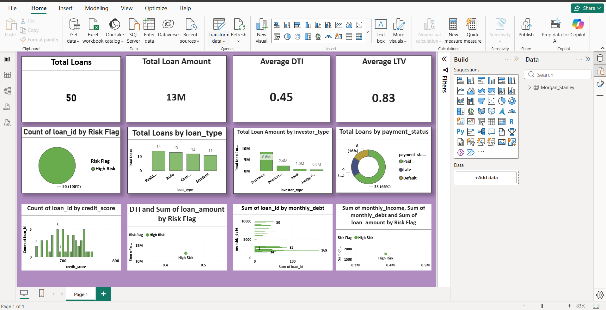

# 🏦 Loan Risk Portfolio Analysis (SQL + Power BI)

## 📌 Project Overview
This project simulates a real-world banking analytics workflow to analyze a loan portfolio and identify credit risk patterns. It combines SQL-based data analysis with Power BI visualizations to support data-driven lending decisions.

The project focuses on borrower income, debt behavior, credit score, loan type, and risk classification.

---

## 🎯 Business Objective
The main goals of this project are:

- Analyze loan portfolio performance
- Identify high-risk borrowers
- Evaluate repayment capacity using financial ratios
- Visualize key lending KPIs
- Support credit risk decision-making

---

## 🧱 Project Workflow

### 1. Data Preparation (CSV Dataset)
- Cleaned and structured loan dataset
- Standardized column names (loan_amount, monthly_income, monthly_debt, etc.)
- Ensured data quality for analysis

---

### 2. SQL Analysis
Using SQL, the following calculations and logic were implemented:

- Debt-to-Income Ratio (DTI)
- Loan-to-Value Ratio (LTV)
- Risk Flag classification
- Loan segmentation using conditions
- Aggregation and filtering for insights

---

### 3. Power BI Dashboard
An interactive dashboard was created in Power BI to visualize insights.

---

## 📊 Key Metrics

### 💰 Debt-to-Income Ratio (DTI)
Measures borrower repayment capacity.

DTI = Monthly Debt / Monthly Income

---

### 🏠 Loan-to-Value Ratio (LTV)
Measures loan exposure against collateral value.

LTV = Loan Amount / Property Value

---

### 🚨 Risk Classification
- High Risk:
  - DTI > 0.4  
  - OR Credit Score < 680  
  - OR LTV > 0.8  

- Low Risk:
  - All other cases

---

## 📈 Power BI Dashboard Visualizations

The dashboard includes the following components:

### 🔹 KPI Cards
- Total Loan Amount  
- Total Loans  
- Average DTI  
- Average LTV  

---

### 🔹 Risk Analysis
- Risk Flag distribution (High vs Low Risk)

---

### 🔹 Loan Analysis
- Loan type distribution (Home, Auto, Personal, Student loans)

---

### 🔹 Financial Behavior
- Income vs Monthly Debt comparison
- Credit score distribution
- DTI vs Risk segmentation (scatter analysis)

---

### 🔹 Portfolio Insights
- Investor exposure breakdown  
- Payment status analysis (Paid, Late, Default)

---

## 📊 Dashboard Preview

---

## 🛠 Tools & Technologies

- SQL (Data analysis & transformation)
- Power BI (Data visualization & dashboarding)
- CSV (Raw dataset handling)

---

## 💡 Key Insights

- Identified high-risk borrowers using financial ratios
- Observed strong correlation between high DTI and loan default risk
- Found variation in loan distribution across different loan types
- Visualized borrower financial behavior for better risk understanding

---

## 👨‍💻 Project Outcome

This project demonstrates:
- End-to-end data analytics workflow
- Financial risk modeling techniques
- Dashboard development using Power BI
- Real-world banking domain understanding

---

## 📌 Author
Sushmita  
Data Analyst Portfolio Project
